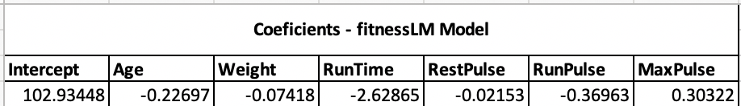

```{r setup, include=FALSE}

knitr::opts_chunk$set(echo = TRUE)

```

```{r libraries, echo=FALSE, message=FALSE}

library(stats)
library(tidyverse)
library(ggplot2)
library(car)
library(effects)
library(doParallel)
library(parallel)

```

\pagebreak


# Executive Summary  


\pagebreak


# Introduction

The present report aims to build a model that predicts Oxygen intake rates 
(a measure of aerobic fitness) supported on a series of measurements. The fitness 
dataset from Rawlings (1998) contains measurements of the following seven variables 
obtained from 31 men:

    * Age: Age in years;  
    * Weight: Weight in kg;  
    * Oxygen: Oxygen intake rate, ml per kg body weight per minute;  
    * RunTime: time to run 1.5 miles in minutes;
    * RestPulse: heart rate while resting;  
    * RunPulse: heart rate at end of run;  
    * MaxPulse: maximum heart rate recorded while running; 

From the data set fitness.csv a linear model (predicting Oxygen) will be developed. 
The bootstrapping function used to provide confidence intervals came from an 
original function provided by Donovan (2018), which was improved at a later stage. 

The report uses R 3.5.1 software (R Core Team, 2018).  It was produced a linear 
model which was fitted in each analysis and the bootstrap used to generate confidence 
intervals for each of the covariates of interest. We aim to exclude variables 
that present, essentially, the same information about response avoiding this way 
collinearity. 

The reasonability of the assumptions on which the model is based were assessed:  

    1. Linearity  
    2. Homoscedasticity  
    3. Independence  
    4. Normality  
  

Bootstrap methods were used in order draw conclusion to hypothesis tests in regards
to the significance of the relationships between the response and the parameter 
estimates. If the confidence interval contains zero, one fails to reject the 
null hypothesis, and if it does not contain zero, one can reject the null hypothesis.


#Exploratory Findings
## Add title
Based on our fitness data set, we are going to implement a Linear Regression 
Model in which explanatory variables (e.g. Age, Weight, RunTime, RestPulse, RunPulse 
and MaxPulse) will help explain or predict the behaviour of the response variable
(Oxygen). The model is specified as follows:

..
```{r load, echo=FALSE}
fitness <- read.csv("data/fitness.csv", header = T)
head(fitness)
```
  

```{r lm, echo=FALSE}
fitnessLM <- lm(Oxygen ~ Age + Weight + RunTime + RestPulse + RunPulse + MaxPulse, 
                data = fitness)

fitnessLM

```
  

A first approach to the relatioship between the variables within our **fitnessLM**
model present the following results:




  
* (Intercept) =  102.93448. This value represents the value of the intercept $\beta_0$,  
when  all other $\beta$ are zero. Therefore, y = $\beta_0$ = Oxygen = 102.93448.  
    
* RunTime = -2.62865. Meaning that everytime RunTime increases by 1 unit, the Oxygen
level decreases by 2.6.
  
In order to forsee how our fitnessLM model is behaving, it can be produced  a     **summary(fitnessLM)** of the model, given the variables.
  

``` {r summary, echo=FALSE}

summary (fitnessLM)

```
  

The Residual Standard Error (2.317) gives us an idea of how far the Oxygen levels 
are from the fitted model.  
  
Multiple R-Squared = 0.8487. Almost 85% of the variation in Oxygen can be explained 
by our model.
  
p-value = 9.715e-09. This value is extremely small, smaller than 0.05. Therefore, 
we **reject the Null Hypothesis ($\H_0$)** which assumes that all the model coefficients 
($\beta_0$, $\beta_1$,...,$\beta_n$) are zero(0).
  
Pr (>|t|) gives us the p-value for the t-test. In this case, all the values which 
are below 0.05 are of interest to our model as it can be improved by those.
  
In this particular case, and looking at the value of Weight (0.18687), it can be 
observed that it is greater than 0.05. Therefore, it fails to reject the $\H_0$ 
(Null Hypothes) which is based on the assumption that all the coefificients 
($\beta_0$, $\beta_1$,...,$\beta_n$) are equal to zero. In this scenario, having 
to remove a variable from the model, the variable Weight would be one of the 
possibilities, for instance.

##Collinearity
it can be said that, when 2 variables are highly correlated, then there is 
collinearity. In fact, at this stage, what we want is to "exclude variables that 
offer essentially the same information about response, i.e., we want to avoid 
collinearity. 

 vif: Calculates variance-inflation and generalized variance-inflation factors 
for linear, generalized linear, and other models. In this case RunPulse (8.437273)
and MaxPulse (8.743848) have very similar values, meaning that they are correlated.
Therefore, these variables offer, essencially, the same information. So, the varible
with the highest value (MaxPulse) can be omitted.
display if bigger than 5 they are correlated therefore give same info and we 


```{r vif, echo=FALSE}

vif(fitnessLM)
vif(fitnessLM) > 5  

```

##The new model less MaxPlus

updated model removed MaxPulse - we now have the new fit for the original model

```{r New Model, echo=FALSE}

fitnessLM <- lm(Oxygen ~ Age + Weight + RunTime + RestPulse + RunPulse, 
                data = fitness)
fitnessLM  

```

##final Model

The main objective is to find a balance and have a good set of covariates 
within our model. If we look only at a few set of variables we are likely to be
disregarding valuable information. On the other way around, if we include, 
in our model, both essential and non-essential variables in a model, the standard
error, confidence interval and, p-values tend to be larger. (g17, 2.5.1)
In order to determine the finalModel, it will be used the function step(), which
uses the Akaike Information Criterion (AIC) to select the model,based in the 
following rule: the lower the AIC the better the model.

-----using command step()------------------------------------------------------
```{r Final Model, echo=FALSE}

finalModel <- step(fitnessLM) 

```


now i have the final model with RunPulse, Age, RunTime
The AIC value is now (59.04). Removing either RunPulse, or Age, or RunTime would 
result in a much higher AIC. Therefore it is better to keep the model as it is.

##CHECKING THE MODEL ASSUMPTIONS
#ASSESSING LINEARITY
conclude about the plot -  age and RunPulse are similar and close to zero. 
The steeper the slop the better,
the covariate RunTime gives us more info about the selected model so Runtime 
is the most important variable within the model.

# Appendix
### Code
```{r eval=FALSE}

fitnessLM <- lm(Oxygen ~ Age + Weight + RunTime + RestPulse + RunPulse + MaxPulse, 
                data = fitness)

fitnessLM

```