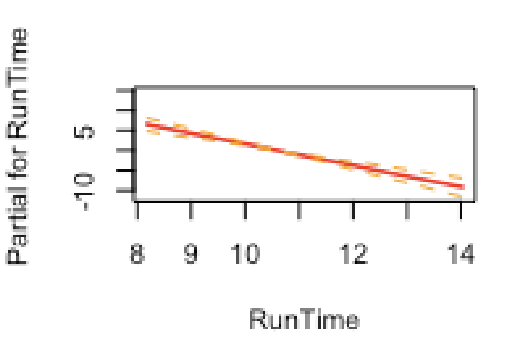
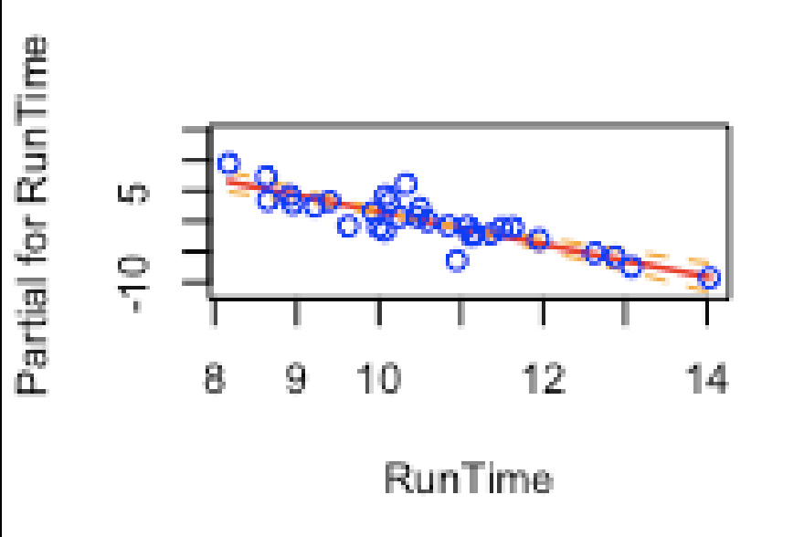
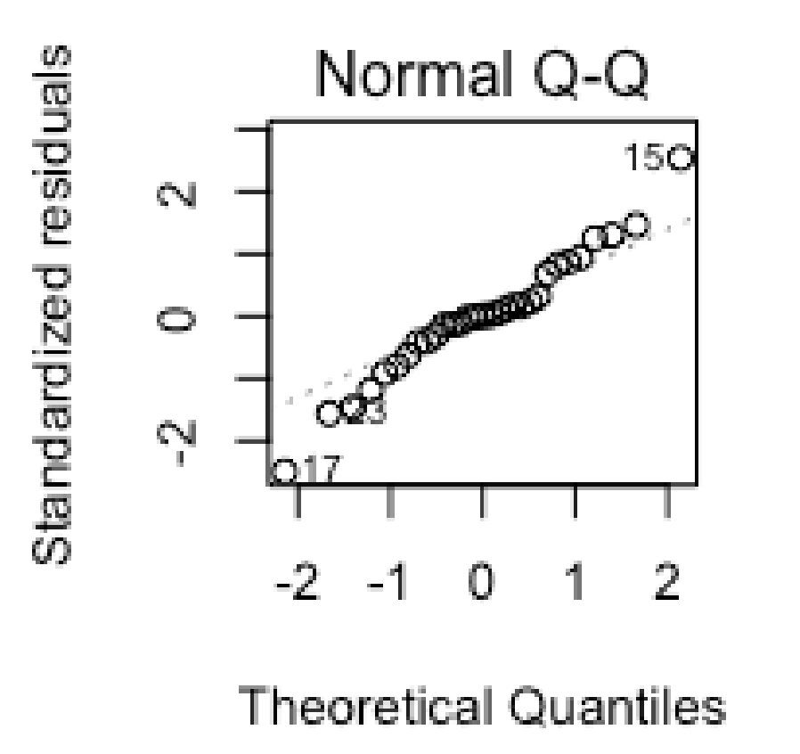

  
  
```{r setup, include=FALSE}
knitr::opts_chunk$set(echo = TRUE)
```
  
  
```{r libraries, echo=FALSE, message=FALSE}
library(stats)
library(tidyverse)
library(ggplot2)
library(car)
library(effects)
library(doParallel)
library(parallel)
```
  
  
\pagebreak
  
  
# Executive Summary  
  
  
The aim of the present report id to build a best fit model that predicts Oxygen intake rates using the fitness dataset from Rawlings (1998), which contain measurements of seven variables obtained from 31 men.
  
  
The initial Linear Regression Model to be implemented will have six explanatory variables **(e.g. Age, Weight, RunTime, RestPulse, RunPulse and MaxPulse)** that will help explain or predict the behaviour of the response variable (Oxygen).
  
  
Starting from a general model which includes all the variables, and through the analyses of each variable and respective interactions, one aims to produce a best fit linear model.
  
  
In order to decide which variables better interact with the dependent variable y (Oxygen) some statistical methods (e.g. Bootstrap, Randomisation) will be performed in order to decide the composition of the Final Model.
  
  
The aim is to exclude variables that present, essentially, the same information about response avoiding this way collinearity. The focus of the whole report is to find a balance and have a good set of covariates within our Oxygen model.
  
  
In order to help the reader and to facilitate understanding of the model development several visual elements (plots) will be added in the report.
  
  
In order to guarantee that the model is being developed within reasonable, several assumptions will be assessed along the way (Linearity, Homoscedasticity, Independence, Normality).
  
  
A final Model, or the best fitted model will be presented.
  
  
\pagebreak
  
  
# Introduction
  
  
The present report aims to build a model that predicts Oxygen intake rates 
(a measure of aerobic fitness) supported on a series of measurements. The fitness 
dataset from Rawlings (1998) contains measurements of the following seven variables 
obtained from 31 men:
  
  
    * Age: Age in years;  
    * Weight: Weight in kg;  
    * Oxygen: Oxygen intake rate, ml per kg body weight per minute;  
    * RunTime: time to run 1.5 miles in minutes;
    * RestPulse: heart rate while resting;  
    * RunPulse: heart rate at end of run;  
    * MaxPulse: maximum heart rate recorded while running; 
  
  
From the data set fitness.csv a linear model (predicting Oxygen) will be developed. 
The bootstrapping function used to provide confidence intervals came from an 
original function provided by Donovan (2018), which was improved at a later stage. 
  
  
The report uses R 3.5.1 software (R Core Team, 2018).  It was produced a linear 
model which was fitted in each analysis and the bootstrap used to generate confidence 
intervals for each of the covariates of interest. We aim to exclude variables 
that present, essentially, the same information about response avoiding this way 
collinearity. 
  
  
The reasonability of the assumptions on which the model is based were assessed:  
  
  
    1. Linearity  
    2. Homoscedasticity  
    3. Independence  
    4. Normality  
  
  
Bootstrap methods were used in order draw conclusion to hypothesis tests in regards
to the significance of the relationships between the response and the parameter 
estimates. If the confidence interval contains zero, one fails to reject the 
null hypothesis, and if it does not contain zero, one can reject the null hypothesis [7].
  
  
\pagebreak
  
  
# Exploratory Findings
  
  
## Fitness Data Set
  
  
Based on our fitness data set, we are going to implement a Linear Regression 
Model in which explanatory variables (e.g. Age, Weight, RunTime, RestPulse, RunPulse 
and MaxPulse) will help explain or predict the behaviour of the response variable
(Oxygen). The model is specified as follows:
  
  
```{r load, echo=TRUE}
fitness <- read.csv("data/fitness.csv", header = T)
head(fitness)
```
  
  
## The Initial Model
  
  
```{r Initial Model, echo=FALSE}

fitnessLM <- lm(Oxygen ~ Age + Weight + RunTime + RestPulse + RunPulse + MaxPulse, 
                data = fitness)

fitnessLM
```  
  
  
A first approach to the relationship between the variables within our **fitnessLM** 
model present the following results:
  
  

  
  
* (Intercept) = 102.93448. This value represents the value of the intercept $\beta_0$,  
when all other $\beta$ are zero. Therefore, y = $\beta_0$ = Oxygen = 102.93448.  
  
  
* RunTime = -2.62865. Meaning that everytime RunTime increases by 1 unit, the Oxygen
level decreases by 2.6.
  
  
In order to foresee how our fitnessLM model is behaving, it can be produced a     **summary(fitnessLM)** of the model, given the variables.  
  
  
```{r summary, echo=FALSE}

summary (fitnessLM)

```
  
  
The **Residual Standard Error (2.317)** gives us an idea of how far the Oxygen levels 
are from the fitted model.  
 
  
* Multiple R-Squared = 0.8487. Almost 85% of the variation in Oxygen can be explained 
by our model.
  
* p-value = 9.715e-09. This value is extremely small, smaller than 0.05. Therefore, 
we reject the Null Hypothesis (H0) which assumes that all the model coefficients 
(Betas) are zero(0).
  
  
* Pr (>|t|) gives us the p-value for the t-test. In this case, all the values which 
are below 0.05 are of interest to our model as it can be improved by those.
  
  
* In this particular case, and looking at the value of Weight (0.18687), it can be 
observed that it is greater than 0.05. Therefore, it fails to reject the Null Hypothesis
(H0)) which is based on the assumption that all the coefficients Beta are equal to zero. 
In this scenario, having to remove a variable from the model, the variable Weight would be,
for instance, one of the possibilities.
  
  
# Collinearity
 
  
Collinearity, simply, can be seen as the correlation between the predictor or independent  variables, in a way such that they express a linear relationship in a regression model [9].
It can be said that when two variables are highly correlated, then there is 
collinearity. In fact, at this stage what we are looking at is to exclude variables that 
offer, essentially, the same information about response, i.e., we want to avoid 
collinearity. Therefore, we will use **VIF** to calculate variance-inflation and generalized variance-inflation factors **(GVIF)** for linear, generalized linear, and other models [9]. 
 
  
```{r vif, echo=FALSE}

vif(fitnessLM)

```
  
  
```{r vif boolean, echo=FALSE}

vif(fitnessLM) > 5 

```
  
  
In this case, looking at the values presented by **RunPulse (8.437273)** and **MaxPulse (8.743848)**, one can easily realise that they have very similar values, therefore are correlated. These variables offer, essentially, the same information. So, the variable with the highest value **(MaxPulse)** can be omitted.
 
  
## The new model less MaxPulse
  
  
The following is the updated model. The **fitnessLM** with the variable **MaxPulse** removed.
We now have the new fit for the original model.
  
  
```{r fitnessLM, echo=FALSE}
fitnessLM <- lm(Oxygen ~ Age + Weight + RunTime + RestPulse + RunPulse, 
                data = fitness)
fitnessLM  
```
  
  
## Final Model
  
  
The main objective here, and within the whole report, is to find a balance and have a good set of covariates within our Oxygen model. If we look only at a few set of variables we are likely to be disregarding valuable information. On the other way around, if we include, in our model, both essential and non-essential variables, the standard error, confidence interval and p-values tend to be larger [9]. In order to determine the **finalModel**, it will be used the function step(), which follows the **Akaike Information Criterion (AIC)** to select the model, based in the following rule: **the lower the AIC the better the model**.
  
  
```{r final model, echo=FALSE}

finalModel <- step(fitnessLM)

```
  
  
We have now reached the final model **(finalLM)** which contain the variables **RunPulse**, **Age** and **RunTime**.
  
With a starting AIC of 61.96 on the first step we have now come up with an **AIC value of (59.04)**. Removing either RunPulse, or Age, or RunTime would result in a much higher AIC. Therefore it is wiser to leave the model as it is and assume it as the better fitted model.
  
  
# Checking Model Assumptions
  
  
## Assessing Linearity
  
  
At this stage, partial residual plots, both with and without interaction, are appropriate to check the linearity for each term within the working model.
  
  
```{r linearity no interaction, echo=FALSE}

par(mfrow = c(3,2))
termplot(finalModel, se = T)
termplot(finalModel, se = T, partial.resid = TRUE, col.res = 'blue')

```
  
  
Looking at the plots (slopes) one can infer that the variables **Age** and **RunPulse** are similar and close to zero. When it come to the variable **RunPulse** it presents a steeper slope. The steeper the slope is, the better the variable fits within the model. The objective here, as said before, is to include variables that fit the model. In fact what we are doing is [9]:
  
  
* including variables with strong relationships between _x_ and *y* (variables already considered within the model);
  
  
* see if these offer new information about _y_;
  
  
* looking at the slope of the line (regression coefficient);
  
  
* verify the amount of scatter along the line. The least scatter, the more important.
  
  
* identify large residuals.
  
  
As it can be observed in Figure 3, the covariate RunTime gives us more information about the selected model. It has not only a steeper line but very little scatter along the line, which leads us to point **RunTime** as probably the most important variable within the model, at this stage. 
  
  

  
  

  
  
### Partial Residual Plots
  
  
At this stage we have add on the residuals to model and once again **RunTime** seems to present the best fit to the model as the residuals tend to be more concentrated along the slope line.
  
  
```{r Age, echo=FALSE}

plot(effect("Age", finalModel, rug = TRUE)) 

```
  
  
```{r RunPulse, echo=FALSE}

plot(effect("RunPulse", finalModel, rug = TRUE))

```
  
  
```{r RunTime, echo=FALSE}

plot(effect("RunTime", finalModel, rug = TRUE))

```
  
  
Looking at **RunTime** plot, compared with **Age** and **RunPulse**, one can notice a higher convergence of points to the central line (no outliers) and the extremes are narrower than the other two variables in analysis. The smother the line, the better the variable contribution to the model. Once again **RunTime** has proven to be a higher performing contributor to the model.
  
  
## Assessing Constant Variance - Homoscedasticity
  
  
### The finalModel Plot
  
  
```{r Homoscedascity, echo=FALSE}

par(mfrow = c(2,2))
plot(finalModel)

```
  
  
_"Constant error variance can be checked visually using residual plots"_ [9, p.21]. Therefore, looking at the plots, namelly the __Scale-Location plot__ one can observe that the residuals show roughly equal spread across the range of fitted values (the red line is almost straight and the residual points are spread along the line). This way, the constant variance assumption __(homoscedasticity)__ can also be validated.  
  
  
## Assessing Independence
  
Since we have assumed from the very beggining that relationship amongst each covariates and the response were linear, we also need to verify another model assumption (Independence). In order to verify the independence we will use the Durbin-Watson test, *"which computes residual autocorrelations and generalized Durbin-Watson statistics and their bootstrapped p-values"* [12]   
  
```{r Independence, echo=FALSE}

durbinWatsonTest(resid(finalModel))

```
  
  
 Following the results and considering that our Null Hypothesis H0 is the correlation of the errors equal to zero, with a resulting p_value > 0.05, one can infer that it failed to reject the Null Hypothesis and that the independence assumption is verified. 
  
  
## Normality
### QQ Normal

In order to check normality, as it can be checked visually, we will be using a quantile-quantile (QQ) plot.
  
  
  
  
  
As it can be seen we have residual values that can be plotted against a hypothetical sample (quantiles) from a N(0, 1) normal distribution. Has we obtained a straight line with scatter, we can infer that the normality assumption is checked [6].
  
  
### Shapiro-Test
  
  
It was also performed the **shapiro.test** to the **finalModel** resulting in a p-value (0.4492) < 0.05. Therefore it failed to reject the NULL hypothesis (H0), which is "the residuals are normally distributed".
  
  
This way, the normality assumption for the model is also checked and confirmed.
  
  
```{r shapiro test, echo=FALSE}

shapiro.test(resid(finalModel))

```
  
  
# Bootstrapping
  
  
The general technique used to estimate _"unknown quantities associated with statistical models"_ [11].
  
  
Often the bootstrap is used to find:  
  
  
1. standard errors for estimators,
  
  
2. confidence intervals for unknown parameters or 
  
  
3. p values for test statistics under a null hypothesis.  
  
  
*"Thus the bootstrap is typically used to estimate quantities associated with the sampling distribution of estimators and test statistics"*[11].
  
  
The aim of this section is to create a function for bootstrapping algorithm to use inside other functions and to provide confidence intervals for all terms in the **finalModel** [10].  
  
  
```{r bootstrapping, echo=FALSE}

bootLM <- function(samples, inputData, index){
  #Purpose: Generate the linear regression beta coefficients
  #Inputs: samples: a dataframe containing the indices for the bootstrap samples
  #        inputData: a dataframe containing the response variable, which must be 
  #        in the first column of the dataframe, and the covariates of interest
  #        index: the index of the position in the BootResults that Bootlm 
  #        should be applied to
  #Outputs: Beta: An matrix containing the parameter estimates from a linear 
  #         regression
  
  bootData <- inputData[samples[, index], ]
  Xmat <- bootData[, -1]
  Ymat <- bootData[, 1]
  beta <- solve(t(Xmat)%*%Xmat)%*%t(Xmat)%*%Ymat
  return(beta)
}

lmBoot_par <- function(inputData, nBoot){
  #Purpose: Generate a large number of linear regression beta coefficients using
  #         bootstrap methods.
  #Inputs: inputData: a dataframe containing the response variable, which must be 
  #        in the first column of the dataframe, and the covariates of interest
  #        nBoot: the number of bootstrap samples to generate.
  #Outputs: BootResults: An arraycontaing the parameter estimates of each 
  #         each bootstrap sample.
  #         ConfidenceIntervals: A matrix containing 95% confidence intervals 
  #         for each parameter.
  
  #Calculate the number of observations in the dataset 
  nObs <- nrow(inputData)
  
  #Create the sample data with 1s for the intercept
  sampleData <- as.matrix(cbind(inputData[, 1], 1, inputData[, -1]))
  
  #Set up parallisation
  nCores <- detectCores()
  myClust <- makeCluster(nCores - 1, type = "PSOCK")
  registerDoParallel(myClust)
  
  # Create the a matrix of indices for the bootstrap samples
  bootSamples <- matrix(sample(1:nrow(inputData), nObs * nBoot, replace = T), 
                        nrow = nObs, ncol = nBoot)
  
  #Use parallised sapply to apply bootLM to bootResults matrix
  bootResults <- matrix(NA, nBoot, ncol(sampleData[, -1]))
  bootResults <- parSapply(myClust, 1:nBoot, bootLM, inputData = sampleData, 
                           samples = bootSamples)
  
  #Close parallisation
  stopCluster(myClust)
  
  return(t(bootResults))
}

filteredData <- fitness %>% select(Oxygen, Age, RunTime, RunPulse)
bootRes <- lmBoot_par(filteredData,  1e4)

bootResCI <- matrix(NA, ncol(bootRes), 2, byrow = T)
for(i in 1:ncol(bootRes)){
  bootResCI[i, ] <- quantile(bootRes[, i], probs = c(0.025, 0.975))
}
colnames(bootResCI) <- c('2.5%', '97.5%')
rownames(bootResCI) <- c('intercept', 'Age', 'RunTime', 'RunPulse')
bootResCI

```
  
  
Bootstrap methods were used in order draw conclusion to hypothesis tests in regards
to the significance of the relationships between the response and the parameter 
estimates. If the confidence interval contains zero, one fails to reject the 
null hypothesis, and if it does not contain zero, one can reject the null hypothesis [7]. 
  
  
So, base in this assumption and looking at the output results for the variables **Age [-0.4631321, -0.05926544]**, **RunTime [-3.4440874, -2.19519845]** and **RunPulse [-0.2040866, -0.06207323]** one can observe that there is no ZERO(0) within the Confidence Interval, for each of the variables. Therefore, we can reject the NULL hypothesis (H0), which was having all the beta coefficients (b0=b1=bn) equal to zero.
  
  
# Randomisation 
  
  
Randomisation tests are closer to more traditional parametric tests than are bootstrapping procedures. The usual goal is to test some null hypothesis, although that null is distinctly different from what it would be with a parametric test [3].
  
  
Randomisation testes allow us to compute confidence limits and look at distributions of outcomes.
   
  
```{r Randomisation, echo=FALSE}

randFunc <- function(nRand){
  set.seed(180029941)
  fitness <- read.csv("data/fitness.csv", header = T)
  estimatedCoef <- coef(lm(Oxygen ~ Age + RunTime + RunPulse, data = fitness))
  
  simResults <- matrix(NA, nRand + 1, 4)
  simData <- fitness
  
  for(i in 2:(nRand + 1)) {
    simData$Oxygen <- sample(fitness$Oxygen, nrow(fitness), replace = F)
    simLm <- lm(Oxygen ~ Age + RunTime + RunPulse, data = simData)
    simResults[i, ] <- coef(simLm)
  }
  
  simResults[1, ] <- estimatedCoef
  colnames(simResults) <- c('intercept', 'Age', 'RunTime', 'RunPulse')
  
  simPvalues <- matrix(NA, 1, 4)
  for(i in 1:4){
    locEst <- c(1, rep(0, 999))
    locEst <- locEst[order(simResults[, i])]
    k <- which(locEst == 1)
    simPvalues[i] <- min(k / (nRand + 1), 1 - k / (nRand + 1)) * 2
  }
  colnames(simPvalues) <- c('intercept', 'Age', 'RunTime', 'RunPulse')
  return(simPvalues)
}
randFunc(1000)

```
  
  
Looking at the results for the covariates **Age** and **RunTime**, they present a higher p-value (>0.05) than the covariate **RunTime**, under the NULL hypothesis (H0 = there is no correlation between the response variable and the covariates). For a p_value < 0.05 there is a real difference between the covariate and the response variable. This leads us to conclude that the covariate **RunTime** is the most important covariate for this particular model. 
  
  
\pagebreak
  
  
#Conclusions
  
  
The initial Linear Regression Model was implemented with six explanatory variables **(e.g. Age, Weight, RunTime, RestPulse, RunPulse and MaxPulse)** in order to help explain or predict the behaviour of the response variable (Oxygen).
  
  
In order to determine the **finalModel**, along side with methods like Bootstrap and Randomisation, the function step () was utilised. It follows the **Akaike Information Criterion (AIC)** to select the model and ended up helping in the selection of the final model, or model with the lowest AIC. 
  
  
On the path to the Final Model, or the best fit model, variables like **RestPulse, Weight, MaxPulse** were dropped down and the final model ended up containing the variables _Age, RunPulse and RunTime_ as the final covariates interacting with the response variable Oxygen.
  
  
This leads us to conclude that the covariate **RunTime** is the most important covariate for this particular model.
  
  
Finally, these model estimates are computer generated and not always the chosen model has the "perfet" covariates. Sometimes it is necessary to look at other aspects of correlation between covariates and decide differently.   
\pagebreak  
  
  
# Bibliography
  
  
[3]Agresti, A., & Franklin, C. (2007). STATISTICS - the art and science of learning from data. (Pearson Prentice Hall, Ed.). New Jersey.
  
  
[11]Boos, D. (2003). Introduction to the Bootstrap World. Statistical Science, 18, 168–174.
  
  
[2]Brownlee, J. (2018). A gentle introduction to k-fold cross-validation, Statistical Methods, 23 May. Obtido de https://machinelearningmastery.com/k-fold-cross-validation/
  
  
[8]Crawley, M. J. (2015). Statistics - An Introduction Using R. ( lda John Wiley & Sons, Ed.) (Second Edi). Sussex.
  
  
[10]Donovan, C. (2018). MT5763 LECTURE NOTES. Obtido de https://moody.st-andrews.ac.uk/moodle/course/view.php?id=8273
  
  
[1]James, G., Witten, D., Hastie, T., & Tibshirani, R. (2014). An Introduction to Statistical Learning with Applications. (S. Publishing, Ed.) (7th ed.). New York.
  
  
[9]Mackenzie, & Scott-Hayward. (2018). MT5761 Statistical Modeling. St Andrews.
  
  
[12]R Documents. (sem data). Obtido 28 de Outubro de 2018, de www.rdocumentation.org/packages/car/versions/3.0-2/topics/durbinWatsonTest
  
  
[13]Rawlings, J. O., Pantula, S. G., & Dickey, D. A. (1998). Applied Regression Analysis: A research Tool, Second Edition. (Springer, Ed.) (Second). Pittsburgh: Springer-Verlag.
  
  
[4]Van den Broeck, J., Argeseanu Cunningham, S., Eeckles, R., & Herbst, K. (2005). Data Cleaning: Detecting, Diagnosing, and Editing Data Abnormalities. Obtido de https://doi.org/10.1371/journal.pmed.0020267
  
  
[7]Verzani, J. (2014). Using R for Introductory Statistics. (C. Press, Ed.) (2nd editio). Florida: A Chapman and Hall Book.
  
  
[6]Wild, C. J., & Seber, G. A. F. (2000). Chance Encounters - A first Course in Data Analysis and Inference. (J. W. & Son, Ed.) (1st ed.). USA: John Wiley & Son, Inc.
  
  
Hadley Wickham (2017). tidyverse: Easily Install and Load the 'Tidyverse'. R package
  version 1.2.1. https://CRAN.R-project.org/package=tidyverse
  
  
H. Wickham. ggplot2: Elegant Graphics for Data Analysis. Springer-Verlag New York,
  2016.
  
  
John Fox and Sanford Weisberg (2011). An {R} Companion to Applied Regression, Second
  Edition. Thousand Oaks CA: Sage. URL:
  http://socserv.socsci.mcmaster.ca/jfox/Books/Companion  
  
  
John Fox, Jangman Hong (2009). Effect Displays in R for Multinomial and
  Proportional-Odds Logit Models: Extensions to the effects Package. Journal of
  Statistical Software, 32(1), 1-24. URL http://www.jstatsoft.org/v32/i01/.  
  
  
Microsoft Corporation and Steve Weston (2018). doParallel: Foreach Parallel Adaptor for
  the 'parallel' Package. R package version 1.0.14.
  https://CRAN.R-project.org/package=doParallel
  
  
R Core Team (2018). R: A language and environment for statistical computing. R
  Foundation for Statistical Computing, Vienna, Austria. URL https://www.R-project.org/.
  
  
\pagebreak  


# Appendices
  
  
## Appendix 1 - Code Part I - Data Exploration & Start Model
  
  
<!--INDIVIDUAL PROJECT MT5763 SOFTWARE FOR DATA ANALYSIS-->
   
<!--ID: 180029941-->
    
<!--PART I-->  
<!--Libraries-->  
  
  
library(stats)  
library(tidyverse)  
library(ggplot2)  
library(car)  
library(effects)  
library(doParallel)  
library(parallel)  

<!--Load Data fitness-->  
  
fitness <- read.csv("data/fitness.csv", header = T)  
head(fitness)  
  
<!--Original Model-->  
  
fitnessLM <- lm(Oxygen ~ Age + Weight + RunTime + RestPulse + RunPulse + MaxPulse, 
                data = fitness)  
fitnessLM  
  
<!--fitnessLM summary-->  
  
summary (fitnessLM)  
  
<!--Collinearity-->  
<!--vif: Calculates variance-inflation-->  
  
vif(fitnessLM)  
vif(fitnessLM) > 5  
  
<!--updated model removed MaxPulse - we now have the new fit for the original model-->  
  
fitnessLM <- lm(Oxygen ~ Age + Weight + RunTime + RestPulse + RunPulse, 
                data = fitness)  
fitnessLM  
  
<!--final Model-->  
<!--using command step()-->  
  
finalModel <- step(fitnessLM)  
  
<!--CHECKING THE MODEL ASSUMPTIONS-->  
<!--ASSESSING LINEARITY-->  
  
par(mfrow = c(3,2))  
termplot(finalModel, se = T)  
termplot(finalModel, se = T, partial.resid = TRUE, col.res = 'blue')  
  
<!--Partial Residual Plots-->  
  
plot(effect("Age", finalModel, rug = TRUE))   
  
plot(effect("RunPulse", finalModel, rug = TRUE))  
  
plot(effect("RunTime", finalModel, rug = TRUE))  
  
<!--II) ASSESSING CONSTANT VARIANCE - HOMOSCEDASTICITY-->  
  
par(mfrow = c(2,2))  
plot(finalModel)  
  
<!--III) ASSESSING INDEPENDENCE-->  
  
durbinWatsonTest(resid(finalModel))  
  
<!--IV) NORMALITY-->  
<!--QQ NORM-->  
  
par(mfrow = c(2,2))  
plot(finalModel)  
  
<!--shapiro test-->  
  
shapiro.test(resid(finalModel))  
  
\pagebreak
  
  
## Appendix 2 - Code Part Two - Bootstrapping
  
  
Create a function for bootstrapping algorithm to use inside other functions
  
  
bootLM <- function(samples, inputData, index){  
  
  bootData <- inputData[samples[, index], ]  
  Xmat <- bootData[, -1]  
  Ymat <- bootData[, 1]  
  beta <- solve(t(Xmat)%*%Xmat)%*%t(Xmat)%*%Ymat  
  return(beta)  
}
  
  
lmBoot_par <- function(inputData, nBoot){  
  
  nObs <- nrow(inputData)  
  
  
  sampleData <- as.matrix(cbind(inputData[, 1], 1, inputData[, -1]))  
  
  
  nCores <- detectCores()  
  myClust <- makeCluster(nCores - 1, type = "PSOCK")  
  registerDoParallel(myClust)  
  
  
  bootSamples <- matrix(sample(1:nrow(inputData), nObs * nBoot, replace = T),  
                        nrow = nObs, ncol = nBoot)  
  
  
  bootResults <- matrix(NA, nBoot, ncol(sampleData[, -1]))  
  bootResults <- parSapply(myClust, 1:nBoot, bootLM, inputData = sampleData,  
                           samples = bootSamples)  
  
  stopCluster(myClust)  
  
  return(t(bootResults))  
}  
  
filteredData <- fitness %>% select(Oxygen, Age, RunTime, RunPulse)  
bootRes <- lmBoot_par(filteredData,  1e4)  
  
bootResCI <- matrix(NA, ncol(bootRes), 2, byrow = T)  
for(i in 1:ncol(bootRes)){  
  bootResCI[i, ] <- quantile(bootRes[, i], probs = c(0.025, 0.975))  
}  
colnames(bootResCI) <- c('2.5%', '97.5%')  
rownames(bootResCI) <- c('intercept', 'Age', 'RunTime', 'RunPulse')  
bootResCI  
  
  
\pagebreak
  
  
## Appendix 3 - Code Part Three - Randomisation  
  
  
randFunc <- function(nRand){  
  set.seed(180029941)  
  fitness <- read.csv("data/fitness.csv", header = T)  
  estimatedCoef <- coef(lm(Oxygen ~ Age + RunTime + RunPulse, data = fitness))  
  
  simResults <- matrix(NA, nRand + 1, 4)  
  simData <- fitness  
  
  for(i in 2:(nRand + 1)) {  
    simData$Oxygen <- sample(fitness$Oxygen, nrow(fitness), replace = F)  
    simLm <- lm(Oxygen ~ Age + RunTime + RunPulse, data = simData)  
    simResults[i, ] <- coef(simLm)  
  }  
  
  simResults[1, ] <- estimatedCoef  
  colnames(simResults) <- c('intercept', 'Age', 'RunTime', 'RunPulse')  
  
  simPvalues <- matrix(NA, 1, 4)   
  for(i in 1:4){  
    locEst <- c(1, rep(0, 999))  
    locEst <- locEst[order(simResults[, i])]  
    k <- which(locEst == 1)  
    simPvalues[i] <- min(k / (nRand + 1), 1 - k / (nRand + 1)) * 2  
  }  
  colnames(simPvalues) <- c('intercept', 'Age', 'RunTime', 'RunPulse')  
  return(simPvalues)  
}  
randFunc(1000)  
  
  
  
  
  
  
  
  
  
  
  
  
  
  
  
  
  
  
  
  
  
  
  
  
  
  
  
  
  
  
  
  
  
  
  
  
  
  

